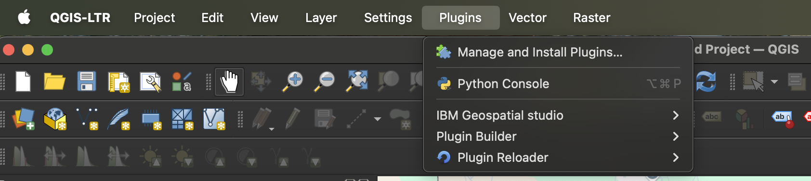
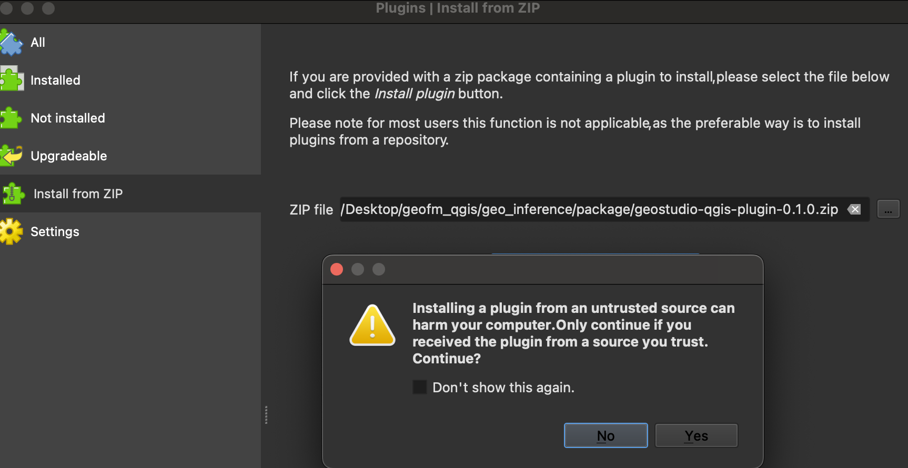
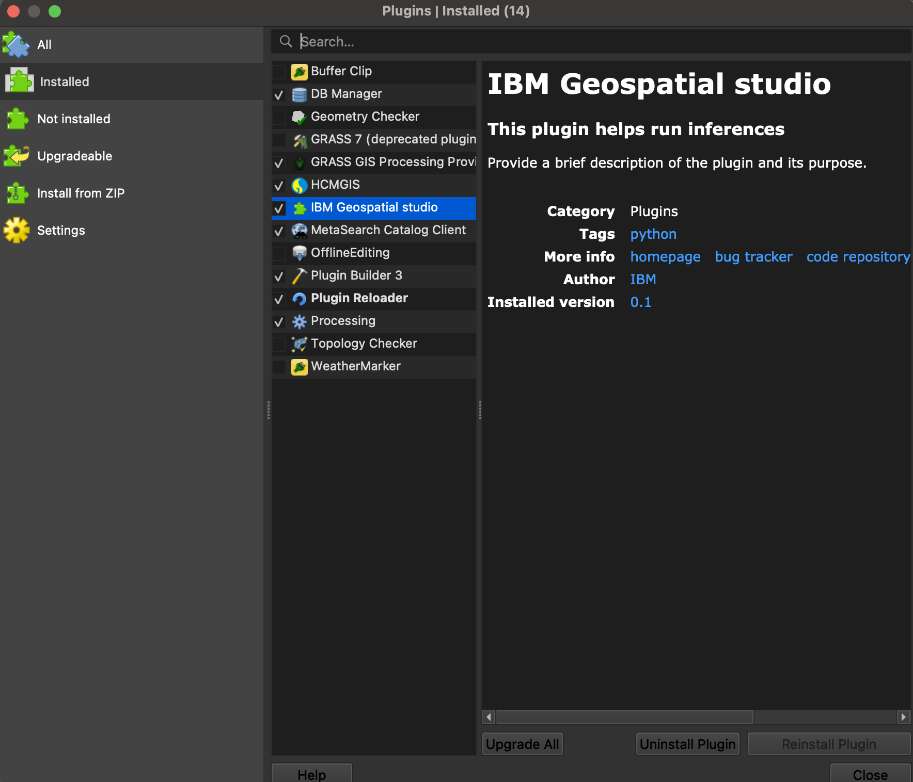

# 🌍 GEO Studio: SDKs + Plugins

<table>
<tr>
  <td><strong>License</strong></td>
  <td>
    
  </td>
</tr>
<tr>
  <td><strong>Distribution</strong></td>
  <td>

[](https://pypi.org/project/geostudio/)
[](https://pypi.org/project/geostudio/)
  </td>
</tr>
<tr>
  <td><strong>TerraStackAI</strong></td>
  <td>
    
    
    
  </td>
</tr>
<tr>
  <td><strong>Built With</strong></td>
  <td>
    
    
    
    <image src=https://img.shields.io/badge/QGIS-Plugin-green?logo=qgis />

  </td>
</tr>
</table>

[](https://terrastackai.github.io/geospatial-studio)

## 🚀 Overview

The **Geospatial Exploration and Orchestration Studio** is an integrated platform for **fine-tuning, inference, and orchestration of geospatial AI models**.  It combines a **no-code UI**, **low-code SDK**, and APIs to make working with geospatial data and AI accessible to everyone, from researchers to developers.

For interaction with the Geospatial Studio, in addition to the web-base UI and RESTful APIs, users can use the following tools (included in this repository):
* Python SDK
* QGIS plugin

These interfaces require access to a deployed instance of the Geospatial Studio, this could be remotely on a cluster, or a local deployment.  If you require more details about the Studio and how to deploy it, [see here](https://github.com/terrastackai/geospatial-studio).

## 🐍 Python SDK
The Geospatial Studio python SDK enables users to interface with the Geospatial Studio APIs in a more natural manner.For more detailed examples on how to use the Geospatial studio SDK, check out [here](/sdk/) for relevant notebooks.


### Prerequisites
* Access Geospatial Studio deployment (this could be local, or remotely on a deployed cluster).

### Installation
1. Prepare a python 3.11+ environment, however you normally do that (e.g. conda, pyenv, poetry, etc.) and activate this new environment.

2. Install the Geospatial Studio SDK:
   ```Shell
   python -m pip install --upgrade pip
   pip install geostudio
   ```

### Authentication

Authentication to the Geospatial Studio is handled by a redirect in the UI, but for programmatic access (form the SDK, for example), the user will need to create an API key.  This is can be easily done through the UI.

1. Go to the Geospatial Studio UI page and navigate to the `Manage your API keys` link.

2. This should pop-up a window where you can generate, access and delete your api keys.  NB: every user is limited to a maximum of two activate api keys at any one time.


3. When you have generated an api key and you intend to use it for authentication through the python SDK, the best practice would be to store the API key and geostudio ui base url in a credentials file locally, for example in /User/bob/.geostudio_config_file. You can do this by:
    ```bash
    echo "GEOSTUDIO_API_KEY=<paste_api_key_here>" > .geostudio_config_file
    echo "BASE_STUDIO_UI_URL=<paste_ui_base_url_here>" >> .geostudio_config_file
    ```

### Example usage of the SDK
In your Python Interpreter:
```py
from geostudio import Client

# change the value of geostudio_config_file below to the path of the file you saved your config in
gfm_client = Client(geostudio_config_file=".geostudio_config_file")

# list available models in the studio
models = gfm_client.list_models()
print(models)

# list available tunes
tunes = gfm_client.list_tunes()
print(tunes)
```

### Example notebooks
For detailed examples on how to use different components of the Studio, please checkout these sample notebooks:
| Notebook  | Description  |
|-----------| -------------|
| [Onboarding a Dataset](./examples/dataset-onboarding/001-Introduction-to-Onboarding-Tuning-Data.ipynb)  | Onboard your curated data to the IBM Geospatial Exploration and Orchestration Studio for fine-tuning  |
| [Fine-tuning a model](./examples/fine-tuning/001-Introduction-to-Finetuning.ipynb)  | Customize a base model by running a regression or segmentation task on the base model using labelled data as input |
| [Uploading completed tune artifacts](./examples/fine-tuning/002-Upload-Complete-Tune-Artifacts.ipynb)  | Deploying a completed fine-tuned TerraTorch model with both checkpoint (.ckpt) and configuration (.yaml) files to the GeoStudio platform  |
| [Hyperparameter Optimization](./examples/fine-tuning/003-Terratorch-Iterate.ipynb)  | Submit an HPO (Hyperparameter Optimization) job to the FineTuning service.  |
| [Running an inference](./examples/inference/001-Introduction-to-Inferencing.ipynb)  | Running different fine-tuned models to generate inferences on the provided datasets. |
| [Uploading pre-computed examples](./examples/inference/002-Add-Precomputed-Examples.ipynb)  | For inferences run outside the studio, you can onboard your layers to the studio for visulaisation  |

Alternatively, you can jump right into the End-to-end walkthrough notebooks:
| Notebook  | Description  |
|-----------| -------------|
| [Burn scars walkthrough](./examples/e2e-walkthroughs/GeospatialStudio-Walkthrough-BurnScars.ipynb)  | Map the extent of areas burned by wildfires |
| [Flooding walkthrough](./examples/e2e-walkthroughs/GeospatialStudio-Walkthrough-Flooding.ipynb)  | Map the extent of flooded areas  |


## 🗺️ QGIS plugin

A QGIS plugin for managing(creating and visualizing) inferences

### Installation

#### Prerequisites

- python 3.8+
- pip package mamanger
- QGIS Long Term Release(LTR) version 3.40.5-Bratislava

<!-- #### Install from the Qgis python plugins repository -->
<!-- You can find the plug-in here: https://plugins.qgis.org/plugins/ -->

#### Install from source

``` bash
git clone git@github.com:terrastackai/geospatial-studio-toolkit.git
cd geospatial-studio-qgis

# create venv and activate it
python3 -m venv venv
source venv/bin/activate

# install requirements
pip install -r requirements-dev.txt
```

#### Deploy/ Install the plugin

``` bash
cd geo_inference
# run the deploy command
make deploy

```

#### Zip the plugin for distribution

```bash
cd geo_inference
## option 1: Zip the local dev version
## change version in metadata
make zip-local

## option 2: Zip the tested deployed version
## change version in metadata
make zip

## option for changing package name
## change plugin name in metadata or package name in makefile
PLUGINNAME = geo_inference # in makefile
PACKAGE_NAME = geostudio-qgis-plugin-$(VERSION) # in makefile
version=0.1 # in metadata.txt

```

### Install from Zip

#### Step 1: Open QGIS

Launch QGIS Desktop on your system.

#### Step 2: Access Plugin Manager

Navigate to **Plugins** → **Manage and Install Plugins** from the menu bar.

#### Step 3: Click Install from zip




#### Step 4: Add zip

Clone this repository

Add the path below:
```
path/geofm_qgis/geo_inference/package/geostudio-qgis-plugin-0.1.0.zip
```


#### Step 5:Install and check the installed tab

Check the box  if not checked to enable the plugin:



#### How to make/view inferences


### Activating the plugin in QGIS

#### Step 1: Open QGIS

Launch QGIS Desktop on your system.

#### Step 2: Access Plugin Manager

Navigate to **Plugins** → **Manage and Install Plugins** from the menu bar.

#### Step 3: Locate the Plugin

1. Click on the **Installed** tab in the Plugin Manager dialog
2. Scroll through the list to find **IBM Geospatial Studio**
3. If you don't see it in the Installed tab, check the **All** tab to install it first

#### Step 4: Activate the Plugin

1. Check the box next to **IBM Geospatial Studio** to enable it
2. Click **Close** to exit the Plugin Manager

#### Step 5: Launch the Geo-Inference Tool

1. Look for the **geo_inference** icon in the QGIS toolbar
2. Click the icon to launch the plugin interface

**Note:** If you don't see the geo_inference icon after activation, try:
- Restarting QGIS
- Right-clicking on the toolbar and ensuring the plugin toolbar is visible
- Checking **View** → **Toolbars** to make sure all toolbars are enabled

### Usage

1. Insert API key
- Get the API Key got from the GEOStudio platform.

#### List inferences
- Click on list inferences button
- Click on one inference to see details
- Click load layer button to load layers from geoserver
- click add image to qgis to load layers from a presigned url

#### Submit inference
- **Load Models** and select the model
- select date start and end /or manually type the date
- Click **select area** button .This creates a layer and you can clcik on the map and draw a polygon
- click **submit inference**.
