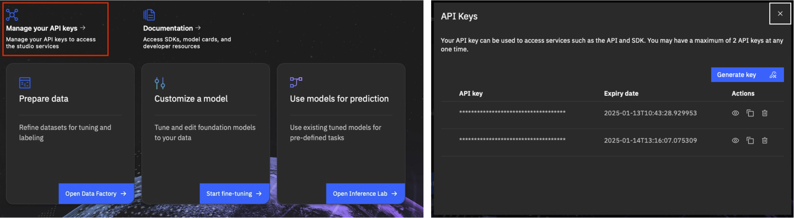

# Welcome to the IBM Geospatial Exploration and Orchestration Studio SDK documentation!

## Installation
First, set up your virtual development environment:
```bash
python -m venv venv/

source venv/bin/activate
```

Install the SDK through pypi:

```bash
pip install geostudio
```

## Usage
- After installing the SDK, obtain an API key.  Navigate to the UI front page and create an api key.  Click on the `Manage your API keys` link. This should pop-up a window where you can generate, access and delete your api keys.




- Store the API key and geostudio ui base url in a credentials file locally, for example in /User/bob/.geostudio_config_file. You can do this by:
    ```bash
    echo "GEOSTUDIO_API_KEY=<paste_api_key_here>" > .geostudio_config_file && echo "BASE_STUDIO_UI_URL=<paste_ui_base_url_here>" >> .geostudio_config_file
    ```

- Connect to the Geospatial Studio SDK Client

    ```python
    from geostudio import Client

    gfm_client = Client(geostudio_config_file=".geostudio_config_file")
    ```

## Test connection
Next, you can now use the gfm_client to make requests to the Geospatial studio api sevrice.
The example below, uses the SDK client to list available models that we can run inference jobs against.

```python
models = gfm_client.list_models()
```

For detailed examples on how to use the Geospatial studio SDK, please see the [examples page](examples/dataset-onboarding/001-Introduction-to-Onboarding-Tuning-Data.ipynb)
